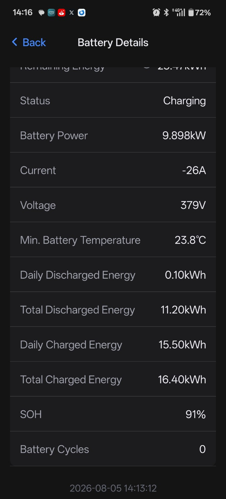
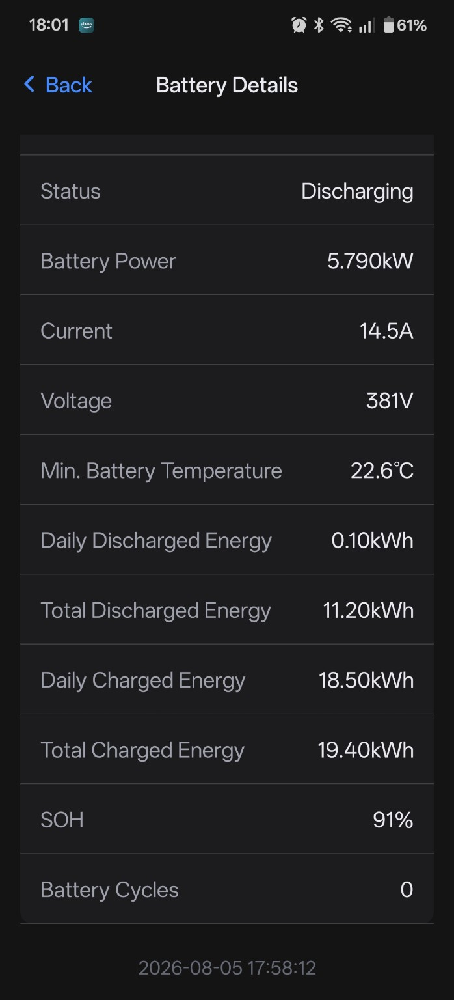
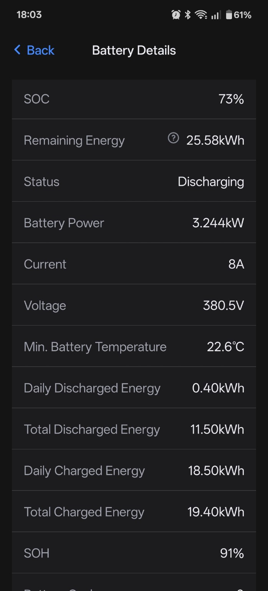
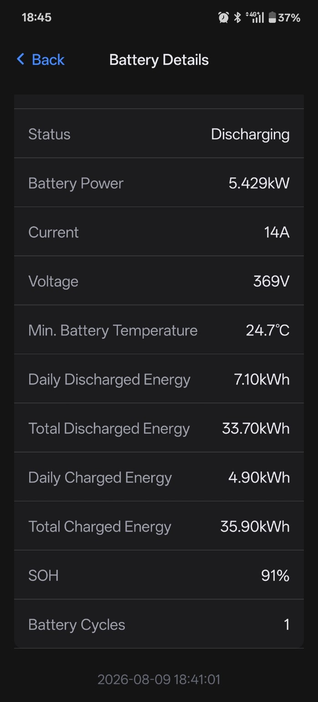
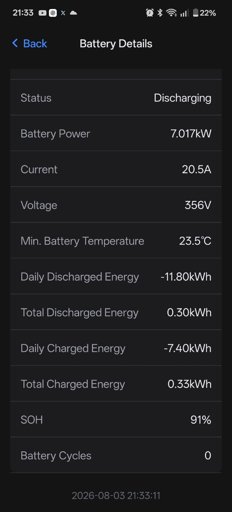

# FoxESS EP-Series Hardware Testing and Evidence

## Purpose

This document records the validation evidence behind the public FoxESS EP-Series CAN protocol documentation and the frozen v67 Battery-Emulator implementation. Its purpose is to show how the important conclusions were reached, what each test actually demonstrated, and where the evidence remains incomplete.

It is not a substitute for the detailed [CAN frame map](CAN-FRAME-MAP.md) or the full [energy-counter analysis](ENERGY-COUNTERS.md).

Successful inverter operation alone does not prove the semantic meaning of every transmitted byte. A complete protocol can operate while some individual fields remain provisional or unresolved. Conversely, a controlled FoxESS app response can prove that Fox accepts or uses a transmitted field without proving the exact algorithm that Fox applies internally.

Native and emulated tests answer different questions:

- genuine EP12 CAN captures show what native Fox hardware actually transmitted, how values changed, and how frames were grouped and timed;
- controlled Battery-Emulator hardware tests show how a real FoxESS inverter and app reacted when the implementation transmitted particular values; and
- the frozen v67 source shows exactly what v67 calculates and sends, but does not by itself prove that a native EP12 calculates the same quantity in the same way.

All conclusions in this document use explicit evidence labels so that a working implementation is not presented as an official FoxESS specification.

## Test environment

The principal real-hardware validation setup was:

| Item | Validation setup | Evidence position |
| --- | --- | --- |
| Inverter | FoxESS KH9 hybrid inverter in a KH-series installation | **Hardware/app-confirmed** |
| Emulator platform | Battery-Emulator running on Stark CMR hardware | **Hardware/app-confirmed** |
| Physical test battery | Nissan Leaf 40 kWh battery pack | **Hardware/app-confirmed** |
| Capacity represented during the relevant v67 tests | Approximately 35 kWh | **Hardware/app-confirmed** configuration and app-threshold context |
| User-visible validation | FoxESS app and its Battery Details page, backed by the real inverter/cloud path | **Hardware/app-confirmed** |
| Power-flow tests | Real charging, real discharging, and charge/discharge transitions | **Hardware/app-confirmed** |
| Native reference | Genuine Fox EP12 CAN captures, including single-unit and dual-unit observations | **Capture-confirmed** |

The Nissan Leaf pack was the physical test battery, not a protocol dependency. The FoxESS EP implementation is intended to remain battery-agnostic. Frozen v67 consumes generic Battery-Emulator datalayer values for battery state, limits, permissions, faults, capacity, voltage, current, cell measurements and temperature. It does not require Leaf-specific structures, a fixed 40 kWh capacity, a 96-cell layout or Leaf-only temperature data.

The approximately 35 kWh value describes the capacity represented in the relevant tests. It must not be confused with a universal protocol constant or with a requirement that every alternative battery expose the same usable or nominal capacity.

## Evidence classes

| Evidence class | What it can prove | What it cannot prove by itself |
| --- | --- | --- |
| **Hardware/app-confirmed** | That the physical inverter accepted a protocol state or field, contactors and power flow operated, a displayed value moved or held during a controlled test, or the app reacted to a deliberate change | The official Fox field name, the complete internal calculation path, or behaviour on every inverter and firmware version |
| **Capture-confirmed** | Genuine EP12 wire values, byte boundaries, transitions, scale relationships, request/response structure and timing seen in the capture | How the inverter would react to an isolated artificial value that was not present in the capture, or behaviour outside the captured operating range |
| **Firmware-supported** | Parsing boundaries, internal relationships and code paths supported by manager-firmware analysis | Official variable names, a complete native algorithm, or real-world behaviour without corroborating capture or hardware evidence |
| Frozen v67 source fact | Exactly what the frozen implementation calculates, gates and transmits | That a native EP12 uses the identical calculation or that Fox officially defines the field in the same terms |
| **Strongly inferred** | A conclusion supported by multiple independent observations whose structure and behaviour agree | A missing decisive native transition or isolated hardware proof |
| **Provisional** | A useful working interpretation or implementation choice with limited evidence | A settled semantic mapping |
| **Unresolved** | That the available evidence is not yet sufficient for a reliable conclusion | Any positive semantic claim beyond the observed raw value or behaviour |

Evidence is weighted in this order:

1. controlled real hardware/app behaviour;
2. genuine EP12 CAN captures;
3. manager-firmware analysis;
4. frozen v67 source facts; and
5. historical comments and earlier theories.

The order does not make unlike evidence interchangeable. For example, a hardware test can establish that an app field responded, while a native capture can establish the genuine wire progression that the hardware test could not show.

## Validation milestones

The version labels below describe investigation checkpoints rather than formal public releases. Dates are omitted where the retained evidence does not establish them.

| Checkpoint | Purpose | Hardware result | What it proved | What it did **not** prove |
| --- | --- | --- | --- | --- |
| v33 | Preserve an earlier known hardware-working reference | Recorded as an earlier successful hardware checkpoint | **Hardware/app-confirmed** that a prior standalone baseline could operate on the real installation | It did not contain or validate the later v65 readiness correction, v66 experiment, v67 `0x1879` architecture or final cycle observation |
| v55 | Saved rollback/reference checkpoint during continued development | Contactors and Battery Details were observed, but charging and discharging did not operate successfully; it was not accepted as hardware-proven | It provided a historical comparison and showed that visible communication or app data alone is not proof of complete operational success | It did not prove successful power flow and must not be described as a hardware-proven release |
| v64 | Clean pre-readiness-fix checkpoint used to isolate the operational regression | Hardware testing exposed an overly strict readiness assumption that prevented the intended power-path operation | The failure narrowed the problem to readiness gating rather than demonstrating that the established CAN mappings were wrong | It did not validate the strict readiness rule as a generic requirement and was not the final working checkpoint |
| v65 | Apply and test the generic readiness correction | Contactors, charging, discharging and Battery Details operation were restored | **Hardware/app-confirmed** that the protocol could operate without making one particular `BMS_ACTIVE` representation a universal prerequisite; it also preserved the battery-agnostic readiness approach | It did not independently prove every frame semantic or the later `0x1878`, `0x1879` and cycle findings |
| v66 | Deliberately test whether `0x1878` bytes 4–7 were Fox's independent Total Charged source by transmitting charged-only Wh | Charge/discharge operation remained functional, but Total Charged continued following the observed fallback relationship | **Hardware/app-confirmed** rejection of charged-only `0x1878` as the independent Total Charged solution | It did not identify the missing direct source and is not the final `0x1878` mapping |
| v67 | Restore native-style absolute throughput in `0x1878`, add directional cumulative capacity in `0x1879`, and perform the decisive energy/cycle tests | Charging and discharging worked; normal Battery Details values populated; Fox accepted an independent charged path; Total Charged held during a subsequent discharge; Battery Cycles moved `0 → 1` near the expected first v67 threshold | **Hardware/app-confirmed** operation of the frozen checkpoint, the charged side of the `0x1879` path, and the cycle field/display transition; it also retained the capture-backed `0x1878` mapping | It did not directly capture a native `0x1879` discharged transition, prove Fox's exact Ah-to-kWh conversion, prove Fox's native cycle formula, or solve counter persistence |

The matching v67 interpretation of `0x1879` bytes 4–7 as cumulative discharged capacity remains **Strongly inferred** pending a sufficiently long native discharge capture.

## Operational proof

Frozen v67 has operated as a complete virtual EP battery on the principal test installation. The following end-to-end behaviours are **Hardware/app-confirmed**:

- the FoxESS inverter recognises and communicates with the virtual EP battery;
- the request/response exchange is sufficient for normal inverter operation;
- contactors close and their active power-path state is represented;
- charging operates using the battery's reported post-safety limits;
- discharging operates using the battery's reported post-safety limits;
- the app reports the Fox-facing current direction correctly during both charging and discharging;
- SOC, voltage, current, temperature and SOH populate in normal operation; and
- nominal, remaining and energy-related Battery Details values populate on the real inverter/app path.

The tests establish functional operation of the complete protocol. They do not mean that every displayed item independently validates one unique CAN field. Some app values are assembled from several frames, and some frames contain multiple fields with different confidence levels.

Similarly, successful charge and discharge operation shows that the live limits and status architecture is operational as a whole. It is not an isolated proof of the official semantic meaning of every limit or model byte. Field-level claims remain governed by [CAN-FRAME-MAP.md](CAN-FRAME-MAP.md).

## Energy-counter proof sequence

The energy architecture was established through a sequence of native observations, controlled experiments and rejected hypotheses. The detailed calculations are in [ENERGY-COUNTERS.md](ENERGY-COUNTERS.md); the sequence below records what the hardware tests contributed.

1. **Directional `0x187A` energy was established.** Physical charging and discharging produced the corresponding charged and discharged app behaviour. In v67, bytes 0–3 carry cumulative charged energy and bytes 4–7 carry cumulative discharged energy, each at `0.1 kWh/count`. Both directions are **Hardware/app-confirmed**. The short native discharge sample did not cross a `0.1 kWh` boundary, so the later hardware/app test is the decisive evidence for the discharged half.

2. **v66 rejected charged-only `0x1878`.** v66 deliberately replaced the capture-backed absolute-throughput value in `0x1878` bytes 4–7 with charged-only Wh. Total Charged still followed the discharged-derived fallback. This is **Hardware/app-confirmed** evidence that charged-only `0x1878` was not the missing independent Total Charged source.

3. **v67 implemented the `0x1879` charged-capacity path.** Genuine dual-EP12 traffic had shown a charging-only progression in bytes 0–3 consistent with cumulative capacity at `0.1 Ah/count`. v67 transmitted directional cumulative capacity using that interpretation. After sufficient real charging, Fox accepted the direct charged history. The charged path is **Hardware/app-confirmed**; its genuine native progression is **Capture-confirmed**.

4. **The direct charged result held during physical discharge.** The decisive observation was approximately:

   - Total Discharged: `11.20 → 11.50 kWh`
   - Total Charged: `19.40 → 19.40 kWh`

   Physical discharge and Total Discharged continued, while Total Charged remained fixed. This proves that Fox had accepted a charged result independent of the ongoing physical discharge. It does not prove Fox's exact internal conversion from cumulative Ah to displayed kWh.

5. **A later return to fallback did not invalidate `0x1879`.** Further discharge could make Fox return to the previously observed fallback relationship. Because the direct path had already been isolated by the hold test, the later fallback is **Hardware/app-confirmed** evidence of plausibility or source-selection behaviour, not evidence that `0x1879` failed. The exact selection threshold and hysteresis remain **Unresolved**.

6. **Battery Cycles moved `0 → 1`.** The app changed to one cycle near the first whole-cycle threshold calculated and transmitted by v67. This is **Hardware/app-confirmed** for the field/display and first v67 threshold, while the native Fox cycle algorithm remains **Unresolved**.

## Battery Cycles proof

The final retained cycle screenshot shows:

| App value | Recorded value |
| --- | ---: |
| Battery Cycles | `1` |
| Total Charged | `35.90 kWh` |
| Total Discharged | `33.70 kWh` |
| Combined displayed throughput | Approximately `69.60 kWh` |
| Capacity represented in the test | Approximately `35 kWh` |

The screenshot is timestamped `2026-08-09 18:41:01` and shows the battery discharging at that observation.

Frozen v67 calculates its transmitted whole-cycle value from charged Wh plus discharged Wh divided by `2 × datalayer.battery.info.total_capacity_Wh`, using integer truncation. That generic Battery-Emulator capacity input was approximately 35 kWh in this test, placing the first v67 threshold near 70 kWh of bidirectional throughput.

The observed `69.60 kWh` app total is consistent with v67 crossing that first threshold once app resolution, update timing and integer display granularity are considered.

This test proves:

- Fox accepts and displays `0x1875` bytes 6–7 as Battery Cycles; and
- the first whole-cycle threshold generated by v67 behaved as expected on the real system.

It does **not** prove:

- that a native Fox EP12 uses the identical v67 throughput denominator;
- that Fox internally calculates its native cycle value from the same source counters; or
- long-term behaviour across many cycles, capacity changes or counter resets.

See [CAN-FRAME-MAP.md](CAN-FRAME-MAP.md) for the byte mapping and [ENERGY-COUNTERS.md](ENERGY-COUNTERS.md) for the exact v67 source calculation and its limitations.

## Native EP12 capture evidence

Genuine EP12 captures provide the native wire reference that controlled Battery-Emulator tests cannot supply. They establish what real Fox batteries sent, while the hardware/app tests establish what the inverter accepted from v67.

The decisive native observations include:

| Native observation | Evidence contribution | Limitation |
| --- | --- | --- |
| Startup requests and responses | **Capture-confirmed** the `0x1871` selector structure, response groups and the native startup progression used to organise the standalone implementation | Does not assign a confirmed semantic meaning to every byte in every response |
| Genuine charge and discharge traffic | **Capture-confirmed** current direction, live transitions and which fields moved or remained fixed during physical power flow | The available discharge portion was much shorter than the charge portion |
| Continuous dual-EP12 operating capture | Supplied a connected startup, light-discharge, charge and later discharge reference across a changing operating state | It represents one native installation and captured operating range, not all firmware or fault conditions |
| `0x1878` bytes 4–7 | The field progressed to approximately `240` while measured absolute transferred energy was approximately `223 Wh` charged plus `23 Wh` discharged, or `246 Wh` total. This established absolute bidirectional throughput rather than charged-only energy. **Capture-confirmed** | Capture integration, frame update timing and integer resolution prevent an expectation of exact sample-for-sample equality |
| `0x1879` bytes 0–3 | In the dual-unit charge, the value progressed `0 → 1 → 2 → 3 → 4`, with paired transitions around `79`, `82`, `158` and `164 Wh` of system charge. This strongly establishes charging-only cumulative capacity at `0.1 Ah/count`. **Capture-confirmed** | It does not reveal Fox's exact later Ah-to-kWh conversion in the app |
| `0x1879` bytes 4–7 | Remained zero through the available approximately `23 Wh` discharge span | The sample was too short to cross the expected first native `0.1 Ah` threshold; the discharged interpretation therefore remains **Strongly inferred** |
| `0x1900`-series single/dual relationships | Single- and dual-unit comparisons separated per-unit values from system-level capacity/model values. One clear example is the `0x1903` system-energy representation changing from raw `57` for one EP12 to `115` for two, consistent with total system energy being quantised after aggregation. **Capture-confirmed** relationship, with manager decoding **Firmware-supported** | The official physical meaning and full consumer of several model parameters remain **Provisional** or **Unresolved** |

The captures should not be reduced to large payload dumps in this document. Their value lies in their provenance, continuity and test context. Original files should be preserved unchanged, while decoding notes and derived calculations should be kept separately. See the repository's [capture documentation](../captures/README.md) for provenance and file-handling guidance.

## Important app observations

| Observation | Recorded values | Interpretation | Confidence |
| --- | --- | --- | --- |
| Real charging with Battery Details populated | Saved screenshot timestamp `2026-08-05 14:13:12`: Status Charging, `9.898 kW`, current `-26 A`, voltage `379 V`, minimum temperature `23.8 °C`, Total Charged `16.40 kWh`, SOH `91%`, Battery Cycles `0` | Confirms end-to-end charging and visible live/battery-detail reporting at that point. It is not, by itself, the decisive proof that Fox had selected the independent charged path. | **Hardware/app-confirmed** |
| Direct charged-path hold during discharge | Total Discharged `11.20 → 11.50 kWh`; Total Charged `19.40 → 19.40 kWh` | Fox had accepted a charged result independent of continuing physical discharge | **Hardware/app-confirmed** |
| Stable fallback-ratio observations | `8.90 / 9.67 = 0.920372`; later `9.10 / 9.89 = 0.920121` | Total Charged followed a discharged-derived fallback in that operating region. The approximate `0.9203` relationship is notably consistent with `0.942 × 0.977 = 0.920334`, but that product is not proven to be Fox's literal internal formula. | Fallback **Hardware/app-confirmed**; coefficient relationship **Strongly inferred** |
| Battery Cycles displayed as one | Saved screenshot timestamp `2026-08-09 18:41:01`: Status Discharging, `5.429 kW`, current `+14 A`, voltage `369 V`, Total Discharged `33.70 kWh`, Total Charged `35.90 kWh`, SOH `91%`, Battery Cycles `1` | Confirms the Fox-facing discharge sign and the first displayed v67 cycle transition near the expected threshold | **Hardware/app-confirmed** |
| Negative daily values after local counter reset | Daily Discharged `-11.80 kWh` with Total Discharged `0.30 kWh`; Daily Charged `-7.40 kWh` with Total Charged `0.33 kWh` | The visible negative values followed a local reset and are consistent with Fox retaining a higher prior cumulative baseline. They demonstrate why volatile cumulative counters are not release-ready. | Visible values **Hardware/app-confirmed**; retained-baseline mechanism **Strongly inferred** from the controlled reset behaviour |

The app's charging and discharging screenshots also demonstrate the Fox-facing current convention: charging is displayed with negative current and discharging with positive current. Battery-Emulator's generic datalayer uses the opposite sign internally, so v67 reverses the sign only for the relevant Fox current fields.

## Selected screenshot evidence

These are unmodified copies of the original supplied FoxESS app screenshots. The publication filenames are descriptive; the image content is unchanged.

- **Working charging and populated Battery Details — 2026-08-05 14:13:12.** Shows Status Charging, battery power `9.898 kW`, current `-26 A`, voltage `379 V`, Total Charged `16.40 kWh`, SOH `91%` and Battery Cycles `0`. This supports the **Hardware/app-confirmed** end-to-end charging observation, but is not by itself the decisive proof that Fox had selected the independent charged path.

  

- **Direct charged-path hold — start of the recorded discharge sequence.** Shows physical discharge with Total Discharged `11.20 kWh` and Total Charged `19.40 kWh`.

  

- **Direct charged-path hold — later in the same discharge sequence.** Shows Total Discharged increased to `11.50 kWh` while Total Charged remained `19.40 kWh`. Together with the preceding screenshot, this is **Hardware/app-confirmed** evidence that Fox had accepted a charged result independent of continuing physical discharge.

  

- **Battery Cycles displayed as one — 2026-08-09 18:41:01.** Shows the visible Battery Cycles value of `1` and the recorded discharging state at that moment. This is **Hardware/app-confirmed** evidence of the displayed v67 cycle transition; it does not prove Fox's native internal cycle algorithm.

  

- **Negative daily counters after the controlled local reset — 2026-08-03 21:33:11.** Shows Daily Discharged `-11.80 kWh`, Total Discharged `0.30 kWh`, Daily Charged `-7.40 kWh` and Total Charged `0.33 kWh`. The visible values are **Hardware/app-confirmed**; the retained-baseline mechanism remains **Strongly inferred** from the controlled reset behaviour.

  

## Restart/reflash evidence

Frozen v67 stores its locally generated installation energy and cumulative-capacity counters in volatile memory. This is a v67 source fact: restarting or reflashing the emulator resets those local totals.

The observed real-system consequences are:

- negative Daily Charged and Daily Discharged values can appear after the local cumulative totals reset while Fox retains or continues using an earlier reference;
- the direct charged history can become implausibly low relative to the retained discharged history, allowing the Total Charged fallback to reappear;
- `0x1878` throughput and `0x1879` capacity history restart with their volatile source values; and
- the locally derived and transmitted equivalent-cycle value resets because the charged and discharged totals feeding it reset.

The evidence establishes the consequence, not the exact native Fox persistence epoch. It remains **Unresolved** whether a genuine EP12 preserves each native cumulative field across BMS power cycling, inverter power cycling, service replacement or other reset conditions.

Persistence is deferred upstream work and remains the principal remaining release-quality blocker. This document records no persistence design and proposes no Battery-Emulator core or NVM changes.

## Readiness-gate validation

The v64-to-v65 test demonstrated that correct frame mappings are not sufficient if the protocol's readiness decision assumes a generic status field is populated identically by every battery integration.

The pre-fix gate depended too strictly on one `real_bms_status == BMS_ACTIVE` representation. The physical test integration did not provide that state in the way the gate expected, so the protocol could appear coherent while the intended operational path remained blocked. v65 removed that universal dependency and restored contactors, charging, discharging and Battery Details operation.

The frozen generic behaviour is, at a high level:

- the overall system is active;
- battery CAN communication is live;
- the battery permits contactor closing;
- no relevant system or BMS fault is present; and
- contactors are engaged before active power-path current, activity and energy accumulation are reported.

This keeps readiness battery-agnostic while retaining fault and contactor safeguards. The test rejects a strict `BMS_ACTIVE` equality check as a universal requirement; it does not claim that the status is unimportant for integrations that populate it reliably.

## Rejected hypotheses proved by hardware

| Rejected hypothesis | Decisive test | Result |
| --- | --- | --- |
| `0x1878` bytes 4–7 are the independent Total Charged source | v66 transmitted charged-only Wh in the field while normal power flow remained operational | Total Charged continued following fallback. The hypothesis is **Hardware/app-confirmed** as disproved. |
| A later return to fallback means the `0x1879` charged path failed | v67 first established the direct path, then observed Total Charged remain at `19.40 kWh` while Total Discharged rose `11.20 → 11.50 kWh`; fallback returned only after further discharge | The direct path had demonstrably worked. Later fallback is source-selection/plausibility behaviour, not `0x1879` failure. **Hardware/app-confirmed**. |
| `real_bms_status == BMS_ACTIVE` must be a strict universal readiness requirement | Compare failed v64 operation with restored v65 contactors, charge, discharge and Battery Details after the generic readiness correction | Rejected as a universal Battery-Emulator integration requirement by **Hardware/app-confirmed** operational testing. |

These rejected hypotheses must not be revived as confirmed mappings without new evidence that directly overturns the relevant hardware result.

## What remains unproven

The following are genuine limits of the current evidence:

- **Strongly inferred:** the native `0x1879` bytes 4–7 discharged-capacity transition and its `0.1 Ah/count` scale. The existing native discharge span was too short to cross the expected threshold.
- **Unresolved:** the exact Fox threshold, hysteresis and state logic that selects between direct Total Charged and the fallback result.
- **Unresolved:** the exact internal conversion from `0x1879` charged Ah into displayed Total Charged kWh.
- **Unresolved:** whether, and in what order, the observed `0.942` and `0.977` model coefficients participate in Fox's fallback calculation. Their product is consistent with the observed ratio but is not a proved native formula.
- **Provisional/Unresolved:** the exact physical meaning and official names of several `0x1900`-series model parameters, even where their byte boundaries and numerical relationships are capture- or firmware-supported.
- **Unresolved:** the persistence and reset epoch of genuine EP12 cumulative energy, capacity and cycle-related data.
- **Unresolved:** Fox's exact daily baseline, day-boundary and retained-history mechanism after a counter decrease.
- **Unresolved:** the exact equivalent-cycle algorithm used internally by a native Fox EP12. The source proves only the formula implemented by v67.
- Any field marked **Provisional** or **Unresolved** in [CAN-FRAME-MAP.md](CAN-FRAME-MAP.md) remains at that confidence level unless new evidence explicitly resolves it.

These limitations are evidence boundaries, not a development roadmap.

## Reproducibility and evidence preservation

Public evidence should be preserved so that another contributor can distinguish an original observation from a later interpretation.

- Preserve original CAN captures unchanged.
- Retain original filenames and capture context where practical.
- Keep raw captures separate from filtered traces, decoded tables, scripts and interpretation notes.
- Record the physical battery arrangement, inverter model, relevant firmware versions, emulator hardware and protocol checkpoint when known.
- Record whether the battery was starting, idle, charging, discharging or transitioning, together with SOC and approximate power where available.
- Keep native EP12 observations separate from values deliberately transmitted by Battery-Emulator.
- Label integrations, ratios and threshold calculations as derived work rather than raw capture values.
- Do not edit raw evidence to make it fit a later interpretation; correct the interpretation instead.
- Preserve screenshots in their original form and describe only the values and states they visibly demonstrate.
- Do not imply that an app screenshot proves an unrelated CAN field or a hidden internal algorithm.
- Do not distribute proprietary Fox firmware binaries. Publish only the minimum derived findings required to explain the protocol evidence.

Where a precise date, firmware version or test condition was not retained, the public record should say that it is unknown rather than reconstructing it from memory.

## Evidence summary

The evidence now strongly establishes that the standalone FoxESS EP implementation operates on a real FoxESS KH-series installation using Battery-Emulator and a non-Fox physical battery. Startup communication, contactor handling, charging, discharging, core live data, status and limit behaviour work on the tested system.

The directional `0x187A` energy paths are **Hardware/app-confirmed**. The `0x1878` absolute-throughput mapping is **Capture-confirmed** and restored in v67. The `0x1879` charged-capacity path is supported by genuine native progression and is **Hardware/app-confirmed** as Fox's accepted independent charged path; the matching discharged half remains **Strongly inferred** pending direct native transition evidence.

Fox's Total Charged fallback behaviour is **Hardware/app-confirmed**, while its exact selection logic and coefficient use remain **Unresolved**. The Battery Cycles field/display and the first v67 threshold transition are **Hardware/app-confirmed**, without claiming that Fox's native internal cycle algorithm has been reproduced.

The remaining uncertainties are stated explicitly rather than being hidden behind the fact that the complete protocol works on the principal test installation.
